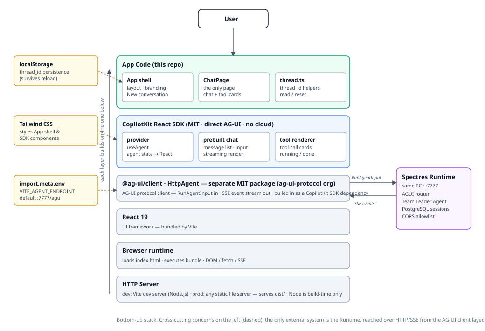

# Spectres Web Client — Frontend Architecture

> The living description of this project's design. Updated in place as the
> app evolves. Product vision and cross-layer decisions are owned by the
> Runtime project (`../Spectres-Runtime/docs/architecture.md` and
> `docs/adr/`); this document covers only the frontend.
>
> Last updated: 2026-09-20 · Covers: v0.1.0 (MVP)

---

## 1. Overview

Spectres-Web-Client is a **static single-page application** that lets the
user chat with the Spectres Runtime Master Agent over AG-UI. It has no
backend of its own: the build output (`dist/`) is plain HTML/JS/CSS that any
HTTP server can host, and the browser talks directly to the Runtime's AG-UI
endpoint.



MVP topology: Runtime (`localhost:7777`) and this app (dev server or a
static server over `dist/`) run on the same home PC; the browser is on that
PC. Cross-origin calls are permitted by the Runtime's `CORS_ALLOWED_ORIGINS`
allowlist. No tunneling, no remote access, no cloud.

## 2. Layered Stack (bottom-up)

Each layer builds only on the layers below it; nothing reaches sideways or
upward. See the diagram above for nesting.

### 2.1 HTTP Server

Serves the static build (`index.html` + bundled assets). Dev: Vite dev
server. Prod: any static file server over `dist/`. This is the *only*
server-side concern of the project — there is no application backend.

**Node.js is a build-time-only toolchain**: it runs the bundler (Vite) and
the dev server, and nothing else. The production artifact is plain static
files — no Node process, no runtime server dependency.

### 2.2 Browser runtime

Loads `index.html`, executes the bundle. Provides DOM, `fetch`/SSE, and
`localStorage` — the only platform APIs the app relies on.

### 2.3 React 19

The UI framework. Bundled by Vite; strict TypeScript throughout.

### 2.4 AG-UI protocol client — `@ag-ui/client` `HttpAgent`

The wire layer. POSTs `RunAgentInput` to the configured endpoint and
consumes the SSE event stream (text deltas, tool-call lifecycle, state
snapshots, run lifecycle). It is the app's *only* network dependency and
the only place the Runtime is reachable.

Note: `@ag-ui/client` is a **separate MIT package** maintained by the
`ag-ui-protocol` organization — not part of the CopilotKit SDK. It enters
the dependency tree as a dependency of `@copilotkit/react-core`; v0.1.0
does not install or import it directly (the SDK wraps it), but it is shown
as its own layer because it is the protocol implementation and an
independently versioned package.

### 2.5 CopilotKit React SDK (MIT)

Sits on React and the AG-UI client. Three pieces used in v0.1.0:

- **provider / `useAgent`**: owns the agent connection and exposes agent
  state as React state. Direct AG-UI connection — no CopilotKit Runtime, no
  CopilotKit Cloud, no API keys.
- **prebuilt chat component**: message list, streaming rendering, input.
- **built-in generic tool-call renderer**: tool calls appear as cards with
  running/done states.

Styling note: current CopilotKit components are themselves styled with
Tailwind utilities (the SDK depends on `tailwind-merge` /
`tw-animate-css`), so our Tailwind usage for layout is the same styling
system the components use — no compatibility shim needed.

### 2.6 App code (this repo)

The thinnest layer — everything above is library code:

- **App shell**: full-viewport layout, branding, "New conversation" button.
- **ChatPage**: the only page; composes the prebuilt chat component and
  enables the tool renderer.
- **`thread.ts`**: `thread_id` helpers — read from `localStorage` on load
  (conversation resumes from the Runtime's PostgreSQL session store),
  generate and persist a fresh id on "New conversation". The only durable
  client-side state.

## 3. Cross-Cutting Concerns

| Concern | Mechanism | Touches |
|---------|-----------|---------|
| Styling | Tailwind CSS (plus the CopilotKit prebuilt stylesheet) | App shell, SDK components |
| Thread persistence | `localStorage` via `thread.ts` | App code → agent connection |
| Endpoint configuration | `VITE_AGENT_ENDPOINT` via `import.meta.env`, default `http://localhost:7777/agui` | HttpAgent wiring |

One configuration mechanism for all environments; no environment-detection
branches anywhere in the code.

## 4. Run Lifecycle (data flow)

1. User sends a message in the chat component.
2. The provider builds a `RunAgentInput` (thread id, run id, messages,
   empty tools/context); `HttpAgent` POSTs it to
   `${VITE_AGENT_ENDPOINT}` (`POST /agui` on the Runtime).
3. The Runtime runs the Team Leader Agent and streams AG-UI events back
   over SSE. Cross-origin is allowed because the Runtime's CORS allowlist
   contains this app's origin.
4. CopilotKit maps events to UI updates: text deltas append to the
   assistant message, tool-call events drive the renderer cards,
   run-finished completes the turn.
5. The Runtime persists the run in PostgreSQL under the thread's session;
   a later page load with the same `thread_id` continues the conversation
   with server-side history.

## 5. Planned Source Layout (v0.1.0)

```text
src/
├── main.tsx            # entry; mounts <App/>, imports styles
├── App.tsx             # shell: layout, branding, New conversation button
├── agent.ts            # CopilotKit provider setup + HttpAgent wiring
├── thread.ts           # thread_id localStorage helpers
├── pages/
│   └── ChatPage.tsx    # the only page: prebuilt chat + tool renderer
└── index.css           # Tailwind entry
```

Deliberately absent: router, state-management library, component library,
API abstraction layer (CopilotKit *is* the abstraction), test scaffolding.

## 6. Error Handling (MVP level)

- **Runtime unreachable / wrong endpoint**: the chat surface shows the
  connection error surfaced by the SDK; README documents checking
  `VITE_AGENT_ENDPOINT` and the Runtime's CORS allowlist.
- **Stale thread id** (session deleted server-side): starting a new
  conversation is the documented recovery; no automatic retry logic in
  v0.1.0.
- No retry queues, offline handling, or error boundaries beyond the SDK
  defaults in this milestone.

## 7. Boundaries (what this app must never grow into)

- No business logic, agent logic, or prompt construction — that is the
  Runtime's job.
- No backend-for-frontend, server routes, or API keys of any kind.
- No vendor-coupled services (CopilotKit Cloud/Intelligence) — AG-UI is the
  only contract.
- Durable user data beyond `localStorage` thread id belongs to the Runtime.

## 8. Evolution Path (later milestones)

| Milestone theme | Architectural impact |
|-----------------|----------------------|
| Custom dispatch/tool cards | Custom renderer registrations; possibly introduce shadcn/ui |
| HITL confirmations | SDK's HITL hooks + confirmation card components |
| Thread list / management | Sidebar + thread metadata from the Runtime; may add a router |
| Per-Slave transparency | Consume Runtime's custom AG-UI events (Runtime ADR 0004 phase 2); subtask UI |
| Remote/cloud deployment | Only `VITE_AGENT_ENDPOINT` changes (Runtime ADR 0005) |
| Tests | Introduce vitest when component logic outgrows manual walkthroughs |

## 9. References

- [`AGENTS.md`](../AGENTS.md) — project conventions, tech stack, decisions
- [`docs/plan/v0.1.0-mvp-chat-client.md`](plan/v0.1.0-mvp-chat-client.md) — current milestone plan
- Runtime architecture: `../../Spectres-Runtime/docs/architecture.md`
- Runtime ADR 0004 (AG-UI visibility), ADR 0005 (deployment topology): `../../Spectres-Runtime/docs/adr/`
- CopilotKit — connect AG-UI agents: https://docs.copilotkit.ai/backend/ag-ui
- AG-UI protocol: https://docs.ag-ui.com/
